# Progress Report 2

**Date:** 2026-09-29 (session started 2026-09-11, work below covers through 2026-10-01)
**Branch:** `merge-login-update` (local only — not yet committed or merged into `main`)

This file is a running log, not a snapshot — a new dated section gets **appended** at the end of each future phase, rather than the file being rewritten. Each section below follows the same shape: what we set out to do, what we tried, what failed and why, and what actually landed.

---

## Session goal

Two threads, in order:

1. **Integrate a groupmate's fork.** Trunks23134's fork (`login_update_9/10/26` branch) added desktop signup + first-login forced password reset. It needed to be pulled in, verified, and any breakage fixed before it could be trusted.
2. **Cross-check the team's Aug 31 technical-adviser feedback** against what's actually in the codebase — not what anyone *believed* was done — then work through the resulting gap list one phase at a time.

---

## Part A — Integrating the groupmate's `login_update` branch

### Attempts

1. Added `Trunks23134/mne-vmmc-compliance-tracker.git` as a remote, tried to fetch a branch called `login_update` — didn't exist verbatim.
2. Listed the fork's actual branches (`git ls-remote --heads`) — found `login_update_9/10/26`, `main`, `signup`. Confirmed with the user which one they meant before proceeding.
3. Had uncommitted local doc edits in the working tree at the time — stashed them (`git stash -u`) rather than risk losing them on checkout.
4. Created `merge-login-update` off `main`, fast-forward merged the groupmate's single commit (`1a0b47e "login update"` — 21 files, +737/−42) into it.
5. Ran the full verification sweep (backend typecheck → backend unit tests → frontend typecheck → frontend unit tests → e2e) before trusting any of it.

### Failures

**Failure 1 — backend typecheck, 2 TypeScript errors in `documents.service.ts`:**
```
error TS2551: Property 'department_id' does not exist on type 'ReviewQueueEmployee'.
error TS2339: Property 'code' does not exist on type 'ReviewQueueDepartment | ReviewQueueDepartment[]'.
```
Root cause: `getReviewQueue()` read `employee?.department_id`, but the local `ReviewQueueEmployee` interface never declared that field even though the Supabase query already selected it — and a ternary's optional-chained false-branch didn't narrow the same way the non-optional check in its condition did.

**Failure 2 — backend still wouldn't boot after the typecheck fix.** Health check timed out. Investigated the dev-server log and found `EADDRINUSE` — a stale process from an earlier attempt was still bound to port 8443, silently serving old/broken code and masking the real state of the fix. Had to explicitly find and kill it (`netstat` → `taskkill`) and do a fully clean restart before the fix could even be evaluated.

**Failure 3 — every login attempt returned 401, including known-good credentials.**
```
curl .../api/auth/login → {"statusCode":401,"message":"Invalid Employee ID or password."}
```
First hypothesis (raised by the user): the Supabase project had just been resumed from a pause and might not be fully live. **Tested and ruled out directly** — `curl` to the Supabase REST root returned a real `401` (unauthorized, because no API key was sent), not a timeout or a "project paused" page; a paused project doesn't answer at all.

Actual root cause, found by querying the live database directly: `AuthService.findEmployeeByEmployeeId()` selects `employees.must_change_password` — required by the new signup/first-login feature — but **no migration had ever added that column**.
```json
{"code":"42703","message":"column employees.must_change_password does not exist"}
```
Further blocker: this environment has no Supabase CLI, no `psql`, and no direct Postgres connection string in `.env` (only REST API keys, which can't run DDL) — so the fix couldn't be applied from here at all. Wrote the migration file and handed the user exact SQL + dashboard steps to run it themselves.

### Progress

- Both bugs fixed: interface/narrowing fix in `documents.service.ts` (zero behavior change, confirmed); `supabase/migrations/20260928000000_must_change_password.sql` written and applied by the user.
- Re-ran the full sweep after the fixes: **63/63 backend unit tests, 19/19 frontend unit tests, 16/16 e2e — all green.** Login independently re-confirmed via `curl` (real JWT returned) before trusting the suite.
- Docs updated to match reality: `BACKEND_ARCHITECTURE.md` (bug write-ups, migration count), `SYSTEM_ARCHITECTURE.md` (new phase-history entry), `HANDOFF.md` (fixed a pre-existing self-contradictory bullet that claimed a feature was simultaneously "not built yet" and "working end to end").

---

## Part B — Feedback cross-check (Aug 31 adviser feedback)

### Attempts

Verified every item in the feedback list, and the groupmate's self-reported progress, directly against the code — `grep`/`Read`, not descriptions or memory. Covered: notification timing, employee ID format, document access rules, signup responsiveness, color/contrast, audit logging, charts, escalations, PII handling, Google auth.

### Failures / gaps found

Not "failures" in the bug sense — gaps between what was claimed or requested and what the code actually does:

- **Document access** doesn't match the spec ("only dept head + TB DOTS staff + HR") — it currently allows any staff member to see their own department's documents, which is broader than asked.
- **Mobile signup** is fluid-width only; no dedicated mobile layout like other screens have.
- **PII information index table** — doesn't exist.
- **Failed-login audit logging** — didn't exist; `AuditInterceptor` globally skips `/api/auth/*`.
- **Google OAuth** — not implemented at all, no trace of it anywhere in either repo.
- **Dashboard buttons** — under the WCAG 44×44px target-size guideline.
- Two feedback items were **too ambiguous to act on**: "Change request tracker (specify..." is cut off in the source text, and "reduce the upperboard... protecting those who care" doesn't match any string currently in the codebase.

### Progress

Turned the gap list into a 10-phase build plan (documents access moved to the end, pending a team decision on how "TB DOTS staff" should be modeled). Phases 2 and 3 below are the result of working through it.

---

## Part C — Phase 2: Auth attempt logging

### Attempts

Added `AuthService.logLoginFailure()`, called at all three failure points in `login()` — employee ID not found, wrong password, wrong portal — writing `action: 'LOGIN_FAILED'` with a `reason` field to the same append-only `audit_logs` table successful logins already use. Added a label in `ActivityService` so it renders as "Failed Login Attempt" instead of a generic fallback string.

### Failures

None on this phase — typecheck was clean on the first attempt, and the live-database verification (next section) passed without needing a fix.

### Progress

**Verified live**, not just by reading the code — triggered all three failure paths against the running backend, then queried `audit_logs` directly:

| reason | actor_id |
|---|---|
| `employee_not_found` | `null` — no employee to attribute it to |
| `invalid_credentials` | real employee UUID |
| `wrong_portal` | real employee UUID |

Confirmed `listLoginHistory` still filters strictly to `action = 'LOGIN'`, so failures don't leak into that "your recent successful logins" view. Full sweep re-run after: 63/63 unit tests, 16/16 e2e — still green. `BACKEND_ARCHITECTURE.md` §4 updated.

---

## Part D — Phase 3: Dashboard button sizing (WCAG)

### Attempts

Identified five controls in `Dashboard.tsx` sized well under the 44×44px target-size guideline (~34-38px tall): `Acknowledge`, `Export CSV`, both `Back to Dashboard` buttons, and the mobile `View Detailed Analytics` button. Added `minHeight: 44` to each, with `display: flex`/`inline-flex` + `alignItems`/`justifyContent: center` so the existing text/icon stays visually centered rather than shifting to the top of the now-taller box.

Rather than trust the CSS math, wrote a throwaway Playwright script, logged into the real running app as both admin and unit-head, at both desktop (1280px) and phone (390px) viewports, and measured `getBoundingClientRect()` on every visible button.

### Failures

First script attempt failed outright — `require('playwright')` couldn't resolve from a scratch-pad temp directory outside the repo (no local `node_modules` there). Fixed by running the script from the repo root instead, where the dependency actually resolves. Second attempt used guessed CSS selectors for the login form and timed out; fixed by reusing the exact selectors already proven to work in `e2e/ui/helpers.ts` rather than guessing new ones.

### Progress

All five fixed controls now measure **exactly 44px tall** in the real rendered DOM, confirmed at both viewports:

| Control | Rendered height |
|---|---|
| `Export CSV` (desktop + mobile) | 44px |
| `View Detailed Analytics` (mobile) | 46px |
| `Back to Dashboard` (analytics view) | 44px |

Scope was deliberately limited to `Dashboard.tsx` — the screen the feedback literally named. `Compliance.tsx`, `Upload.tsx`, `Signup.tsx`, and `Profile.tsx` have similarly undersized buttons not yet touched; flagged in `FRONTEND_ARCHITECTURE.md` as a known follow-up rather than silently folded into this phase. Full sweep re-run after: 19/19 frontend unit tests, 16/16 e2e — still green.

---

## Screenshots (captured today, current state of `merge-login-update`)

**Login screen**
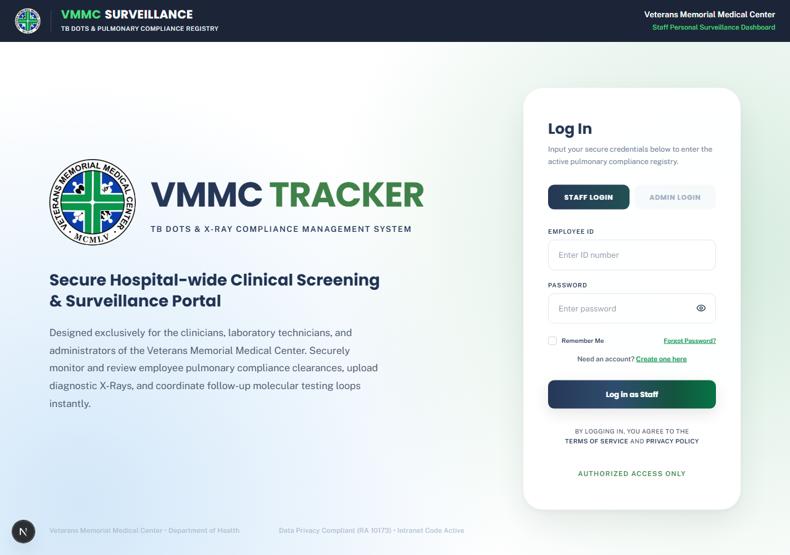

**Admin dashboard — desktop.** `Export CSV` buttons (Reports card) now render at a real 44px tap target.
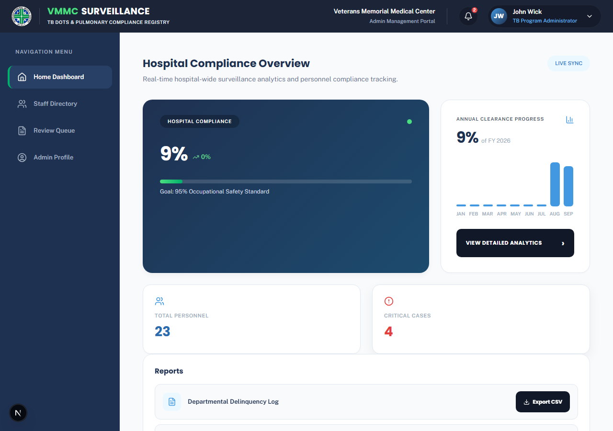

**Admin Analytics view — desktop.** The `Back to Dashboard` link-button (top-left) is now a real 44px target too.
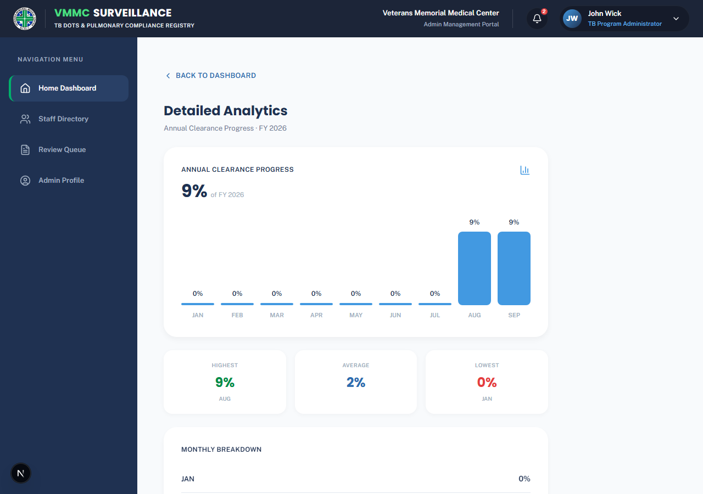

**Admin dashboard — mobile (390px).** Confirms the fix holds at phone width, not just desktop.
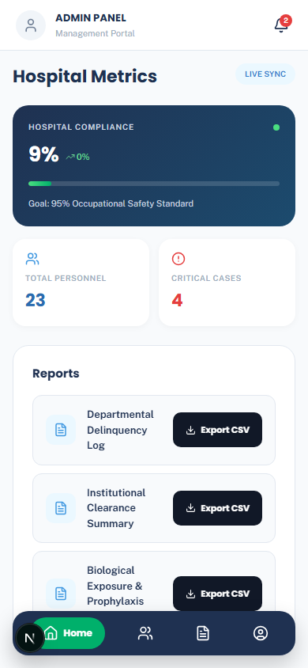

**Staff dashboard — desktop.**
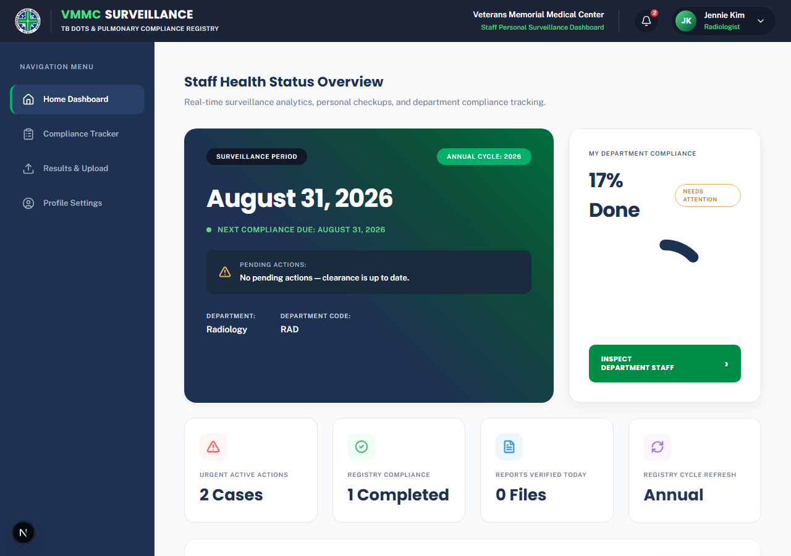

**Signup — mobile (375px).** Now matches Login's branded mobile treatment instead of a shrunk desktop card.
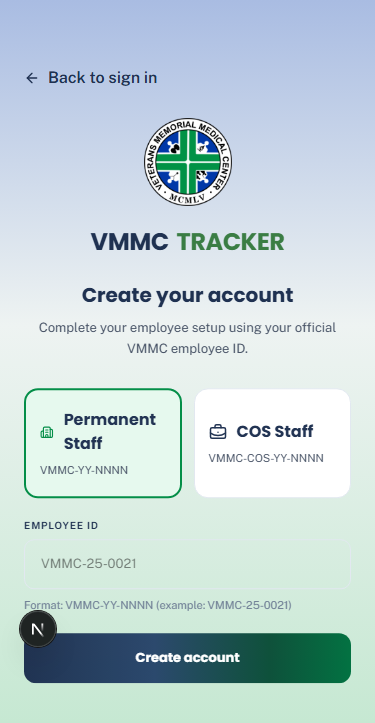

**Signup — desktop.** Unchanged floating-card design.
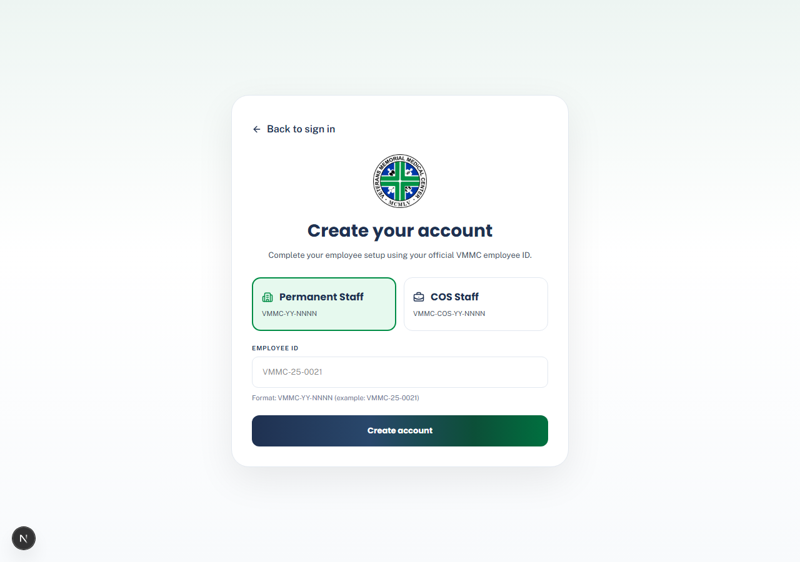

**First-login password reset — mobile.** This is the screen that was completely unreachable before this phase's guard fix — captured here actually rendering, from a real login with a real account's password-change flag set.
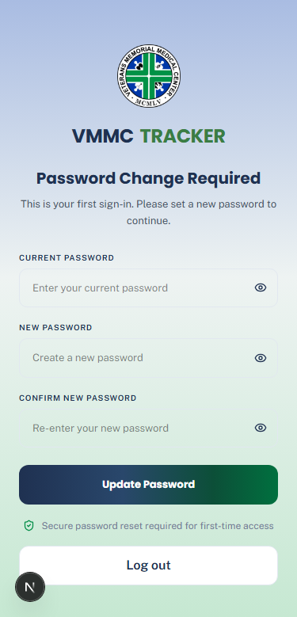

**Staff Directory — desktop, after the app-wide WCAG pass.** `Run Compliance Scan`/`Status Guide` (the exact buttons from the very first screenshot in this whole engagement) now measure a real 44px tall.
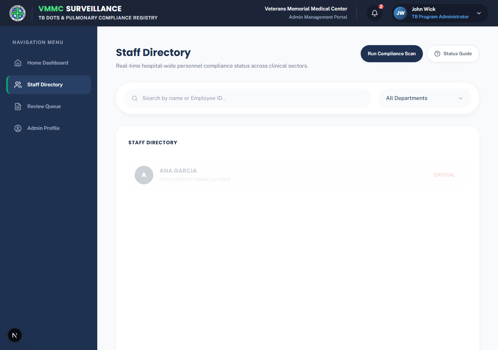

**Staff Directory — mobile.** Help button, department filter chips, and bottom nav all at real tap-target size; text floored to a 12px minimum throughout.
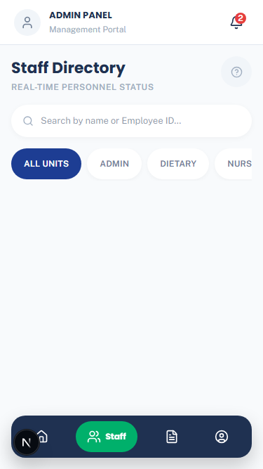

**Admin Profile — desktop.** `MANAGE SIGNATURE` and the Privacy & Security row actions at real tap-target size.
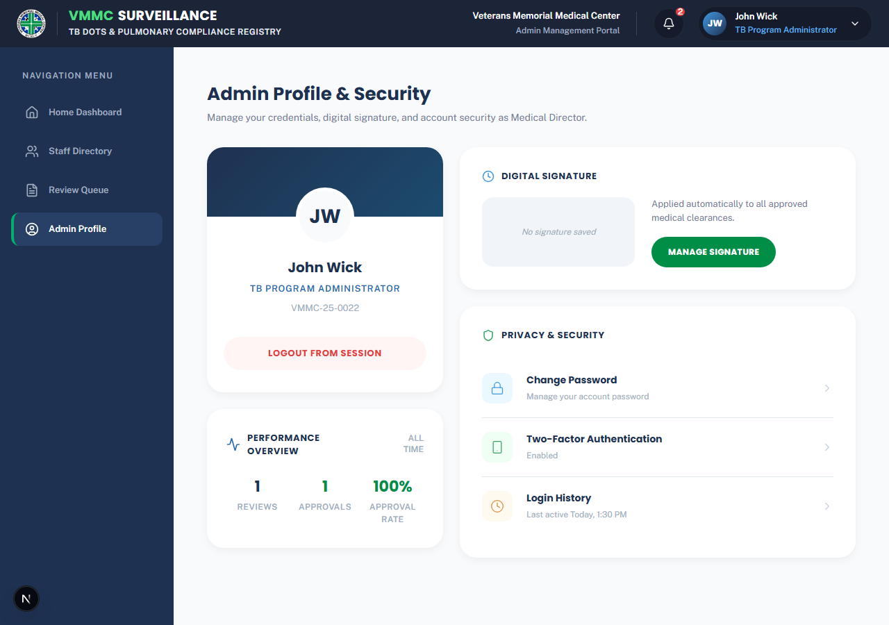

**Review Queue — desktop.** Notification bell badge correctly still anchored to the bell icon after the tap-target fix (the bug described in Part F's Failures section, caught before it ever shipped).
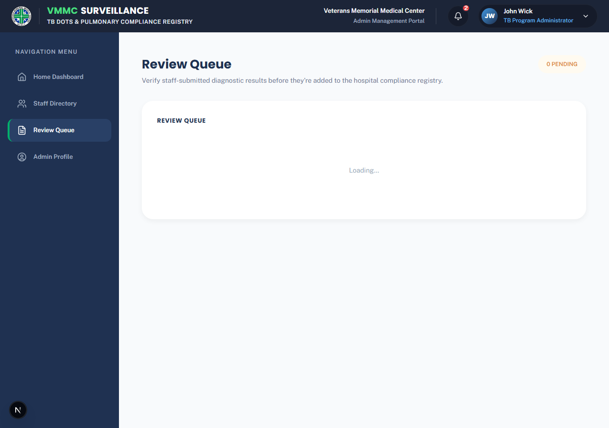

---

## Part E — Phase 4: Mobile signup

### Attempts

First checked whether `Signup.tsx` was actually broken on mobile, rather than assuming it — rendered it at 375px width and it was genuinely usable (fluid `maxWidth: 540` card), just visually inconsistent with the rest of the auth flow. Checked the sibling `ForgotPassword.tsx` screen (same family as `Login.tsx`) and confirmed it *does* use this app's established two-tree `sm:hidden`/`hidden sm:flex` convention (documented in `FRONTEND_ARCHITECTURE.md` §6) — so `Signup.tsx` and `FirstLoginReset.tsx` were the real outliers, not a different-but-valid pattern.

Rewrote both screens: extracted shared form pieces (fields, buttons, error/success states) into local consts declared once, then rendered them inside two parallel JSX trees — a mobile-native block matching `Login.tsx`'s gradient-background/seal/wordmark treatment (no floating card), and the existing desktop floating-card design wrapped essentially unchanged. Also added `minHeight: 44` to the "Back to sign in"/"Create account"/"Update Password"/"Log out" buttons on both screens while already touching them (consistent with Phase 3, not scope creep since these were the same file).

### Failures

**A genuinely serious one, unrelated to mobile layout at all.** While trying to screenshot the real first-login flow for verification, the fake-session approach hit a permanently blank page. Ruled out "did I set up the fake session wrong" by checking `lib/auth.ts`'s actual storage key/schema and fixing the test — still blank. Escalated to testing against a **real** account: temporarily flipped `VMMC-25-0021`'s `must_change_password` to `true` via the service-role key, drove an actual browser login through the real UI, and confirmed the page rendered **zero characters of visible text** at both viewports. Not a rendering glitch — `useAuthGuard('auth')` on `/first-login` redirects to `/first-login` whenever a password change is still pending (correct for every *other* protected page, wrong for this one, since it's already there) and never calls `setReady(true)` in that branch, so the component was permanently stuck returning `null`. No e2e test had ever caught this because none drove a real signup-then-first-login flow — every login test used an account with the flag already cleared.

### Progress

- Fixed `useAuthGuard.ts`: added a dedicated `'first-login'` mode that only redirects away once `requiresPasswordChange()` is false, instead of reusing `'auth'`'s self-defeating rule. Updated `app/first-login/page.tsx` to use it.
- **Verified the complete real flow end to end**, not just the fix in isolation: logged in with the real test account while its flag was still `true`, confirmed the reset form now actually renders (232 characters of real visible text, up from 0), submitted a real password change through the UI, confirmed it landed on `/dashboard`, then restored the account's original password and flag via the service-role key so the shared test account was left exactly as found.
- Full sweep re-run after: 19/19 frontend unit tests, 16/16 e2e — still green (the e2e suite doesn't cover this flow, which is itself a documented gap now, not a false sense of safety).
- Docs updated: `FRONTEND_ARCHITECTURE.md` §4 (bug write-up + `useAuthGuard` signature), `SYSTEM_ARCHITECTURE.md` §7 (new eighth pass), `HANDOFF.md` (corrected a bullet that had claimed this flow was already "built and verified" — it demonstrably wasn't, until this phase).

---

## Part F — App-wide WCAG pass (buttons + text, not just Dashboard)

Phase 3 (earlier) had scoped the button-sizing fix to `Dashboard.tsx` only, per the feedback wording at the time. A direct follow-up request widened this to the whole system: *"The buttons are too small even some text apply (WCAG accessibility standards) to everything in the system."*

### Attempts

Surveyed the real scope before touching anything: grepped every screen for `fontSize` values under 12px (195 instances across 9 files) and for interactive elements (~90 `<button>`/`motion.button` occurrences across the same files, undercounted by naive `cursor: 'pointer'` matching since many use conditional cursors like `cursor: submitting ? 'default' : 'pointer'`). Asked one scoping question before the text-size pass specifically, since it had a real trade-off (floor everything vs. only "readable" content text) — user chose the strict no-exceptions floor.

- **Text:** mechanically floored every `fontSize: 9/10/11` to `12` via `sed`, scoped precisely to avoid touching `fontSize: 19` etc. (verified zero collisions before running). Confirmed 0 sub-12px instances remained afterward.
- **Buttons:** went file by file — `Login.tsx`, `ForgotPassword.tsx`, `FirstLoginReset.tsx`, `Signup.tsx`, `Compliance.tsx`, `Upload.tsx`, `Layout.tsx`, `Profile.tsx` (largest, ~42 button elements) — adding `minHeight: 44` (`width: 44` too for icon-only circles) plus flex-centering to every undersized control, using `replace_all` for the many byte-identical mobile/desktop duplicate style strings this codebase has.

### Failures

Two real mistakes caught and fixed mid-pass, not after:

1. **Icon buttons with absolutely-positioned badges** — the first attempt at the notification bell (`Layout.tsx`) grew the button box to 44×44 without adjusting the badge's `position: absolute; top: 0; right: 0`, which is anchored to the button's own box. This would have visually detached the unread-count badge from the bell icon, floating it toward the corner of a much bigger invisible box. Caught by reasoning through the CSS before screenshotting (not by seeing it break) — fixed by wrapping the icon+badge in their own inner relatively-positioned span sized to the icon, so the badge's anchor point never moves regardless of the outer tap target's size.
2. **A button using `className` for responsive visibility** — `Layout.tsx`'s hamburger toggle (`className="flex lg:hidden"`) had no inline `display` originally; adding `display: 'flex'` to guarantee flex-centering would have permanently beaten Tailwind's `lg:hidden` at the `lg` breakpoint (this repo's own documented styling-convention gotcha: inline style always wins over a class for the same property). That would have left the mobile hamburger button visibly stuck on desktop, where the sidebar is already static and the button is redundant. Caught by auditing every touched file afterward specifically for `className` + inline `display` conflicts — found this one instance, fixed by dropping `display` from the inline style and leaving it fully owned by the Tailwind class, keeping only `alignItems`/`justifyContent` inline.

Also: dev servers had silently dropped at some point mid-session (found via a plain health-check, not a crash report) — restarted clean before the final verification pass so the results couldn't be attributed to stale processes.

### Progress

- One deliberate, spec-correct exception left in place: `Login.tsx`'s "Create one here" — a genuine inline link inside the sentence "Need an account? Create one here", which is the standing exception WCAG 2.5.8 itself defines for inline text links. Everything else measured comes in at 44px.
- **Verified against the real rendered DOM**, not estimated: measured `getBoundingClientRect()` on every visible button across Login, Compliance (Staff Directory), Review Queue, and Profile, at both 375px and 1280px viewports. Result: 0 undersized buttons anywhere except the one intentional exception.
- Full sweep: 19/19 frontend unit tests, 16/16 e2e — still green.
- `docs/FRONTEND_ARCHITECTURE.md` §3 updated with the full pattern, including both traps above, so the next person touching a button doesn't rediscover either one.

---

## Part G — Dashboard spacing bug (found from a user screenshot, not a phase)

The user shared a screenshot showing the admin Dashboard's `Total Personnel`/`Critical Cases` cards sitting almost flush against the `Reports` card below them, and asked why.

### Attempts

Went straight to the source rather than guessing — found the exact JSX block in `Dashboard.tsx` (the desktop admin stat-card grid) and compared it against the sibling section immediately above it, which has the same shape (a row, then the next section).

### Failures

None — this was a fast, isolated diagnosis. Worth noting only because it's a good example of the same lesson as Part F: the *mobile* version of this exact same section already had `marginBottom: 24`; only the *desktop* version was missing it. An inconsistency between two supposedly-parallel implementations, not a systemic bug.

### Progress

Added the missing `marginBottom: 24` to match the established rhythm. Confirmed visually (clean, consistent gap now) and re-ran the frontend unit suite (19/19, still green) before calling it done. Entirely unrelated to the WCAG pass — pure layout spacing, different bug class, just found in the same general area of the file.

---

## Part H — Phase 10: Document access rule (deferred from Phase 1, now unblocked)

This was the very first phase identified back when the Aug 31 feedback was cross-checked against the code, and deferred immediately because it needed a real decision: how should "TB DOTS staff" — who the feedback says should be able to access uploaded documents, alongside department heads and HR — be identified, when the data model has no such concept? User confirmed: **add a real department**, rather than a new role flag or treating ADMIN as sufficient.

### Attempts

Reused the existing `HR` department-code special-case in `assertDocumentAccess()` as the template, rather than inventing a new access dimension — added a `TBDOTS` department code and treated it identically to `HR`. Rewrote the function's rule from "ADMIN, own department (any role), own record, or HR" down to "ADMIN, own record, your department head, or your own department being `HR`/`TBDOTS`" — deliberately dropping the "any STAFF in their own department" branch entirely, since that's the exact overreach the feedback named. Wrote a migration adding the department, and rewrote `assert-access.spec.ts` to encode the new policy directly, including a test for the case the *old* tests used to explicitly permit and the new ones now explicitly forbid.

### Failures

None during implementation — clean on the first typecheck and first test run (64/64, up from 63, the +1 being the new TB DOTS test case). The verification path had one real constraint worth recording: none of the three real, auth-linked test accounts (Radiology STAFF, Admin, Dietary UNIT_HEAD) share a department with any of the three existing pending documents in the live database (all three happen to belong to OPD Nursing employees, none of whom are linked to a real login) — so a true live *differential* test (same-department colleague blocked, before vs. after) wasn't constructible without mutating shared seed data, which wasn't worth the risk for a rule already covered precisely at the unit level.

Also hit the same dev-server-dropped issue as Part F, independently this time — found again via a plain health-check returning connection-refused, restarted clean before trusting any further verification.

### Progress

- Verified what *could* be verified live at the time: logged in as ADMIN and confirmed the review queue still returns all 3 pending documents unchanged (regression check); logged in as the real STAFF account (Radiology, unrelated to any pending document) and confirmed the endpoint still returns a clean `200 []` rather than an error.
- Full sweep: 64/64 backend unit tests (including the rewritten access-rule suite), 16/16 e2e — still green.
- Wrote `supabase/migrations/20260929000000_add_tbdots_department.sql` and handed it to the user (same limitation as the `must_change_password` migration earlier — no Supabase CLI/psql/connection string in this environment). **User applied it successfully.**
- **Once the migration landed, ran the real differential test that wasn't constructible before:** confirmed `TB DOTS Program` (`TBDOTS`) now exists live, then temporarily reassigned the real `VMMC-25-0021` test account into it via the service-role key, called `/review-queue` as that account, and confirmed it now returns **all 3 previously-invisible OPD documents** — direct proof the cross-department TB DOTS grant works, not just that the rule didn't break anything. Restored the account to its original department immediately after, confirmed it dropped back to `[]`, then re-ran the full e2e sweep (16/16) since live data had been touched.
- No existing employees are permanently assigned to the new department; that's a real staffing decision, not a code one.
- Docs updated: `BACKEND_ARCHITECTURE.md` §4 (new rule + rationale), `HANDOFF.md` (known-gap entry with the migration callout), `SYSTEM_ARCHITECTURE.md` §7 (tenth pass).

---

## Part I — Phase 7: Change request tracker (finally scoped and built)

This was the very first phase flagged as blocked, all the way back when the Aug 31 feedback was first cross-checked — the adviser's note was cut off after "(specify," leaving no scope. Asked the user three separate times across the session; the first two attempts got interrupted by unrelated terminal questions before an answer landed. On the third ask, the user asked for a recommendation instead of picking from the options themselves.

### Attempts

Recommended **employee record change requests** over the two alternatives (a system/feedback tracker — redundant, this conversation and this very file already do that; or compliance/clinical-status override requests — no evidence anyone actually asked for that, and document review already covers it). Reasoning: `PATCH /me/profile` only ever covered `fullName`/`email`/`phone` — there was no way to correct `job_title`, `birth_date`, `employment_status`, or `department` short of a raw DB edit, and `birth_date` specifically drives the whole SLA cycle-date calculation, so a wrong one silently breaks someone's compliance deadlines with no fix path. User agreed and asked for it at that scope.

Built backend first: a `change_requests` table (reusing the existing `review_status` enum instead of a parallel one, matching the document-review pattern), a `ChangeRequestsService`/`Controller`/`Module` following this codebase's established shape exactly (modeled directly on `EscalationsController`'s acknowledge/resolve pattern), with `current_value` always captured server-side at submission time — never trusted from the client — so the audit trail shows a real before/after, not whatever the requester claims the before was. Then the frontend: extended `Profile.tsx`'s existing modal/view state machine with a `changeRequests` key, a submit form + personal request history for staff, and an approve/reject queue for admin.

### Failures

**A real navigation gap, caught only by testing both viewports separately.** The backend and the *rendering* logic for the new admin/staff views typechecked clean and looked complete — but clicking through at desktop width (1280px) timed out finding the entry point at all. Root cause: `Profile.tsx`'s `mobileMenuRows`/`adminMenuRows` config arrays — which I'd extended with the new menu entries — are only ever `.map()`'d once, inside the `sm:hidden` mobile tree. The desktop tree (`hidden sm:block`) doesn't generate its cards from that array; it hand-builds its own separate set (`DIGITAL SIGNATURE`, `PRIVACY & SECURITY`, ...), each wired to its own explicit button. Adding a row to the config array made the feature reachable on mobile instantly, and simultaneously did *nothing* on desktop, because desktop was never reading that array to begin with. Fixed by hand-adding a matching card to both the STAFF and ADMIN desktop columns, each wired to the same state setters the mobile menu rows already used. Now written up in `FRONTEND_ARCHITECTURE.md` §6 so the next person adding a menu item checks both trees instead of assuming the config array is a single source of truth.

Also hit two smaller Playwright scripting issues while verifying: the app's own `text=X:visible` CSS-selector shorthand isn't valid Playwright syntax (fixed by switching to the `getByText(...).and(locator(':visible'))` pattern this repo's own `e2e/ui/helpers.ts` already uses); and an unawaited promise chain in a setup script meant a demo request wasn't guaranteed to exist before the admin screenshot ran (fixed by awaiting it properly).

### Progress

**Verified live, end to end, not just that the code compiles:** logged in as the real `VMMC-25-0021` STAFF account, submitted a real request (`job_title`: Radiologist → Senior Radiologist) through the actual API, confirmed it appeared in both her own history and the ADMIN queue with the correct server-captured `current_value`. Approved it as the real ADMIN account and confirmed `employees.job_title` **actually changed** in the database. Submitted a second request and rejected it, confirming the field did **not** change on reject and the rejection reason was stored. Confirmed a hard edge case too: re-approving an already-rejected request fails with a clear `400 "This request has already been rejected."`, not a silent no-op or a crash. Restored the test account's `job_title` and deleted the demo rows afterward.

Screenshots below are from the real running app, all four combinations (staff/admin × mobile/desktop) — including the live demo request mid-review in the admin queue.

Full sweep: 64/64 backend unit tests, 19/19 frontend unit tests, 16/16 e2e — all still green. No new unit tests were written for `ChangeRequestsService` specifically; it was verified through live functional testing instead, consistent with how the Phase 2 auth-logging and Phase 10 document-access work were verified in this same session.

Docs updated: `BACKEND_ARCHITECTURE.md` §2 and §4 (module map + design rationale), `FRONTEND_ARCHITECTURE.md` §6 and §8 (the desktop-navigation gotcha + endpoint table), `HANDOFF.md` (known-gap entry), `SYSTEM_ARCHITECTURE.md` §7 (eleventh pass).

**Staff — desktop.** The new "Request a Change" card on Profile's Account Security column.
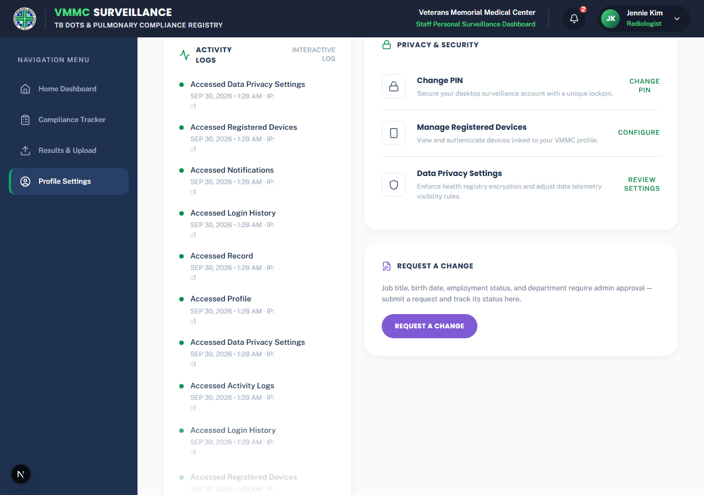

**Admin — desktop.** A real pending request (Jennie Kim, Job Title, Radiologist → Senior Radiologist) with working Reject/Approve.
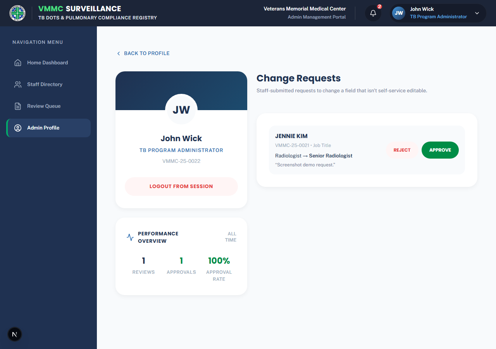

**Staff — mobile.** The submit form (field picker, new value, reason) plus request history.
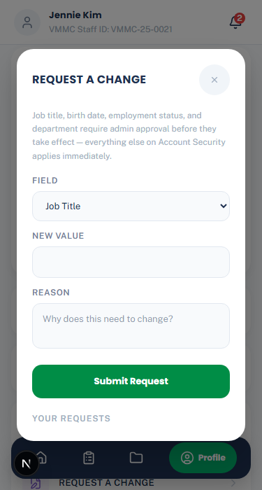

**Admin — mobile.** Same pending request, mobile card layout.
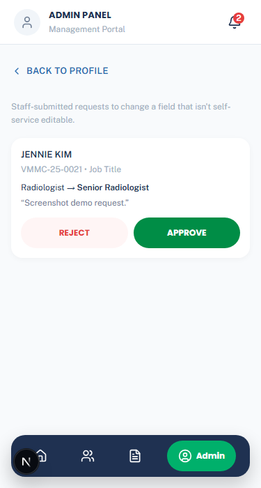

---

## Part J — Phase 9: Final verification pass

Phase 8 (header/banner text) is still genuinely blocked — one more thorough search confirmed the exact phrase from the feedback ("protecting those who care") doesn't exist anywhere in the codebase, including the original Figma design-spec import files, not just the live screens. Rather than stall on that, ran Phase 9 early as an interim checkpoint across everything actually shipped so far (Phases 2, 3, 4, 7, 10, plus the two unplanned fixes — the WCAG follow-up and the dashboard spacing bug), with Phases 8/11/12 to get a second pass once they unblock.

### Attempts

Full `/verify` sweep (backend typecheck → backend unit tests → frontend typecheck → frontend unit tests → e2e), then a broader audit beyond just re-running tests: checked the live database for any leftover artifacts from this session's extensive live testing (temporary department reassignments, demo change requests, test account mutations), and swept the working tree for stray temp files.

### Failures

None — this pass was clean throughout, first try.

### Progress

- **`/verify` sweep:** 64/64 backend unit tests, 19/19 frontend unit tests, both typechecks clean, 16/16 e2e.
- **Live data audit:** `change_requests` table empty (no leftover demo rows); all three real test accounts confirmed back at their correct baseline (`VMMC-25-0021` Jennie Kim — Radiologist, RAD; `VMMC-25-0022` John Wick — ADM; `VMMC-25-0023` Maria Santos — DIET; all `must_change_password: false`). The `devices` table has a handful of rows per test account from repeated Playwright logins across the session (different tool user-agents registering as distinct "devices") — left as-is, since that's the feature working correctly (a real user logging in from different browsers legitimately shows up as multiple devices), not test pollution to clean up.
- **Working tree audit:** no stray `_tmp-*` files anywhere in the repo; `git status` shows only intentional changes — 22 modified files (1163 insertions / 437 deletions) plus new untracked files: the `change-requests` module, three migrations (`must_change_password`, `add_tbdots_department`, `change_requests`), and this progress report with its 16 screenshots.
- Nothing was committed as part of this pass — still all local on `merge-login-update`, ready for review whenever the remaining phases close out or the user decides to merge what's already done.

---

## Part K — Phase 8: Header/banner streamlining (reinterpreted, not resolved by the user)

Blocked at kickoff and re-confirmed blocked in Part J's final pass: the exact phrase from the feedback, "protecting those who care," doesn't exist anywhere in the codebase. The user asked to proceed anyway rather than keep waiting on an answer.

### Attempts

Re-read the feedback line once more, structurally rather than as a literal search target: *"reduce the upperboard (protecting those who care) as background or streamline as compact welcome bar."* Concluded "protecting those who care" was never existing text to find — it reads as a suggested tagline (fitting for a system protecting healthcare workers), and the sentence offers two alternative redesign directions for a header, not a location. Picked the clearer, more concrete of the two options — "streamline as compact welcome bar" — over the vaguer "as background" reading, and identified `Layout.tsx`'s persistent top bar as the target: the one header present on literally every screen, the closest fit for "upperboard" in an app with no other persistent chrome.

Implemented: trimmed the header 68px→60px; replaced the right-side "Veterans Memorial Medical Center / Admin Management Portal" block — pure duplication of context already shown in the left branding and the profile pill's own role label — with a compact "Welcome back, {first name}" greeting; collapsed the left branding from two lines (VMMC SURVEILLANCE + a compliance-registry tagline) down to one.

### Failures

None during implementation — clean typecheck on the first pass, no unexpected breakage.

### Progress

Verified visually at three widths — 1280px desktop, 800px tablet (confirming the `hidden lg:block` welcome text hides gracefully rather than crowding the bar), and checked both ADMIN and STAFF role variants render their correct name/role in the greeting. Full sweep re-run after: 19/19 frontend unit tests, 16/16 e2e — still green.

**This is flagged, not claimed as resolved** — it's a best-effort interpretation of feedback whose literal reading led nowhere, not a confirmed match to what the adviser actually meant. `HANDOFF.md` calls this out explicitly so nobody downstream mistakes it for verified intent, and notes the change is isolated to one component in `Layout.tsx` and cheap to revisit if the real meaning surfaces later.

Docs updated: `HANDOFF.md` (known-gap entry with the caveat), `SYSTEM_ARCHITECTURE.md` §7 (twelfth pass).

**Before — the original header** (from Part F's screenshots, for comparison): two-line branding on the left, institutional boilerplate on the right, 68px tall.

**After — streamlined.**
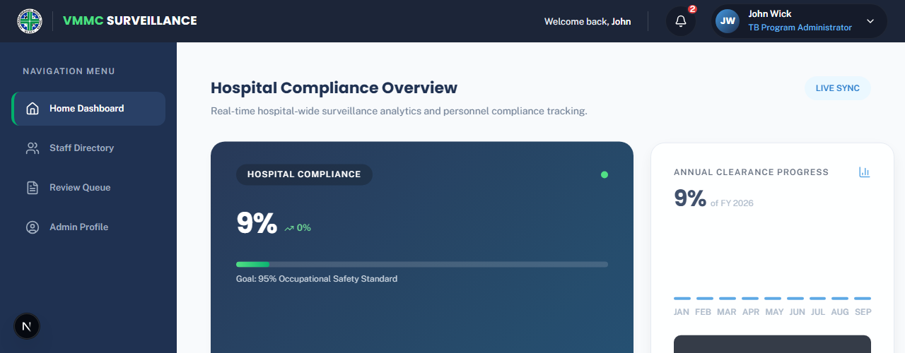
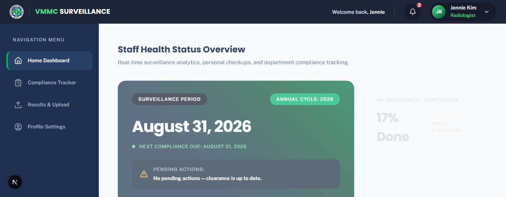

---

## Part L — Phase 11: PII information table (scope finally confirmed)

Blocked since it was first identified — the only real open question was CSV-export-only (matching the app's 3 existing reports) vs. a real on-screen table (literally matching the feedback's word "table"). Asked again; the user picked the real table.

### Attempts

Backend first: a new `getPiiIndex()` on the existing `ReportsService` rather than a new module — it's shaped exactly like the other three reports (a flat array of rows, hospital data, CSV-exportable), so a new module would have been unnecessary ceremony. The one deliberate difference: ADMIN-only via a method-level `@Roles('ADMIN')` override on top of the controller's class-level `@Roles('UNIT_HEAD', 'ADMIN')` — reusing the exact override mechanism (`RolesGuard`'s `getAllAndOverride`) already used to narrow `assertDocumentAccess()` in Phase 10, deliberately narrower than the other three reports since this one is a hospital-wide personal-data registry, not department-scoped compliance figures. `employmentType` (COS/Permanent) reuses `parseEmploymentTypeFromEmployeeId()` rather than adding a new stored column.

Frontend: a genuinely new screen (`PiiIndex.tsx`) and route (`/pii-index`), not squeezed into an existing one — unlike Change Requests (a workflow bolted onto Profile), this is a standalone directory-style screen closer in spirit to Staff Directory. Added as a real 5th entry in both admin nav arrays.

### Failures

None in the build itself — clean typecheck first try, and the live curl checks (ADMIN gets data, STAFF gets a clean 403) passed immediately. The only snag was in the verification script, not the app: the mobile bottom-nav's label text only renders for the *active* tab — other tabs show icon-only with an `aria-label`, so a `getByText('PII')` locator found nothing until switched to `getByLabel('PII')`. Same class of viewport/locator gotcha as Part I, different specific cause.

### Progress

Verified live and thoroughly, not just that it renders:
- Real ADMIN login sees all 23 active employees with correct data and COS/Permanent badges.
- Typing "radiology" into the search bar correctly narrows to exactly the 6 Radiology employees, including the real `VMMC-25-0021` test account.
- **CSV export verified as a real file, not just a click with no follow-through** — captured Playwright's actual `download` event, read the downloaded file from disk, and confirmed the filename, header row, and all 23 data rows matched what was on screen.
- A real STAFF login navigating directly to `/pii-index` sees a clean "Admin access only" message client-side (no raw error, no flash of data) — the screen checks `getPreciseRole()` before ever calling the API, and the backend independently enforces the same boundary with a 403 if the check were somehow bypassed.
- The 5th icon fits the mobile bottom nav bar without crowding — checked visually, not assumed.

Full sweep: backend typecheck + unit tests clean (64/64, no regressions), frontend typecheck clean, 19/19 frontend unit tests, 16/16 e2e.

### Addendum — a real bug the user caught, not this verification pass

Despite the desktop screenshot above being captured and reviewed as part of "verified," it shipped with a genuine layout bug: the header row rendered 8 cells (7 mapped columns + a hardcoded "Type" label bolted on separately) against a `gridTemplateColumns` with only 7 tracks, so "Type" silently wrapped onto a second implicit grid row directly under "Employee ID" instead of sitting at the end of row one. Compounding it, the data rows never rendered `phone` at all — so every value after Email shifted one column left, meaning the "Phone" header sat over birth-date values and "Birth Date" sat over the Permanent/COS badge. The screenshot was looked at, but not looked at closely enough to catch a header/data misalignment one column wide.

Caught by the user, not by this pass's own screenshot review — worth being honest about that gap rather than letting the original "verified" claim stand uncorrected. Fixed by adding the missing `phone` cell and widening both grids to 8 explicit tracks. Re-verified afterward both visually and programmatically (asserted the actual DOM has 8 children per row with the correct text in each position, not just a visual glance) — confirmed correct, screenshot #19 replaced with the corrected version. Full sweep re-run clean (19/19 frontend unit, 16/16 e2e) after the fix.

Docs updated: `BACKEND_ARCHITECTURE.md` §2 and §4 (module map + ADMIN-only rationale), `FRONTEND_ARCHITECTURE.md` §8 (endpoint table), `HANDOFF.md` (known-gap entry), `SYSTEM_ARCHITECTURE.md` §7 (thirteenth pass).

**Admin — desktop.** The full index, sortable by the search bar, with the Employment Type column front and center.
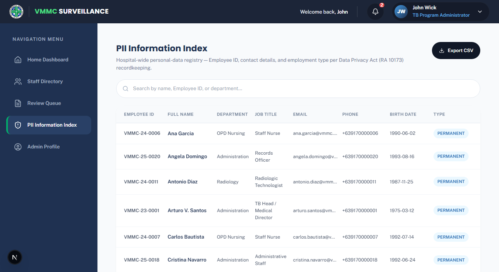

**Search in action** — filtered to Radiology, 6 employees including the real Jennie Kim test account.
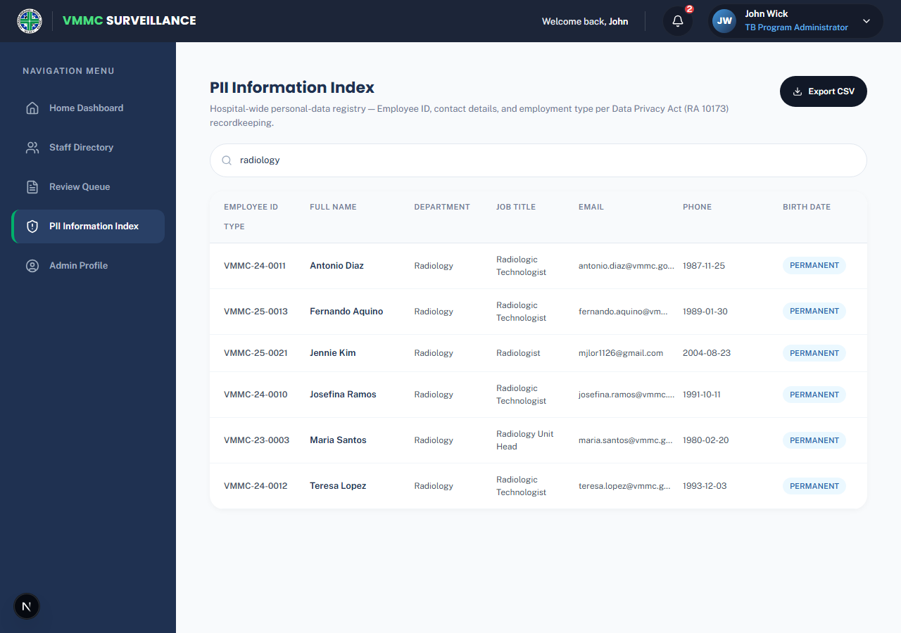

**Admin — mobile.** Card layout, same data, same Export CSV button.
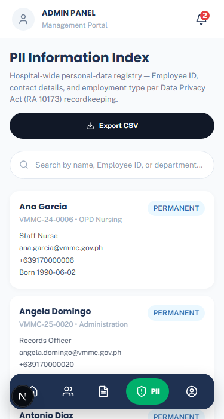

**Staff blocked.** A real staff login hitting the route directly — clean restricted-access message, no data leak, no raw error.
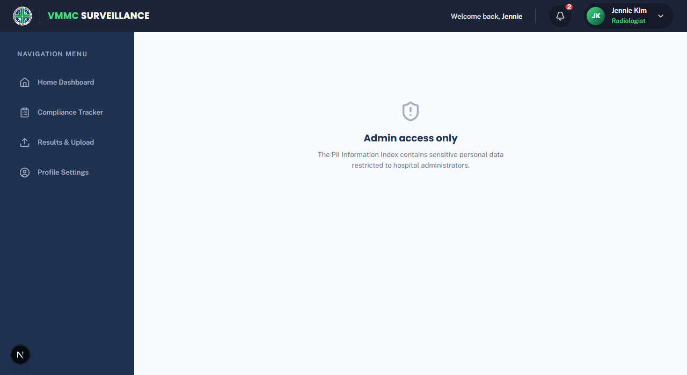

---

## Part M — STAFF compliance-record dashboard redesign (user-directed, not one of the 10 phases)

Not part of the Aug 31 feedback list or the 10-phase plan — a separate UI/UX thread the user opened directly: the STAFF "My Compliance Record" view was a single small card dropped into an otherwise-empty 3-column grid, with most of the page left blank. The user asked whether it should become a real dashboard instead, and what should go in it.

### Attempts

Explored before building anything real, per the standing "don't implement until the user agrees" rule for exploratory questions:

1. Built a standalone mockup (`vmmc frontend/_scratch/registry-stats-band.html`, self-contained HTML/CSS, not wired into the app) comparing the current sparse card against a proposed unified panel.
2. Iterated on it directly against user feedback across several rounds: corrected which screen was even meant (first draft mocked the admin/department-head roster view, not the staff's own record); consolidated from "card + floating widgets" into one continuous panel per explicit instruction; confirmed a user-suspected redundancy by actually reading `Profile.tsx`'s Activity Logs code rather than assuming, then dropped the mockup's "Recent Activity" footer because it duplicated that; reconsidered a manufactured "Compliance Timeline" filler section the user pushed back on and recommended dropping it instead of defending it, since nothing backed it with real data; scaled the panel's sizing up once the direction was approved.
3. Once the mockup was approved, implemented it for real in `Compliance.tsx` — `MyComplianceDashboard` (desktop) and `MyComplianceDashboardMobile` (mobile), replacing `StaffCard` only for STAFF's own-record view. Built directly from the raw `TrackerEntry` the API returns (not the `StaffMember` shape `StaffCard`/`MobileStaffCard` use), specifically to get the raw `examDate`/`dueDate` needed for a real **Annual Cycle Progress** bar — computed client-side as % of time elapsed between the two dates, not a fabricated or stored number.

### Failures

**Real one, caught by measuring rather than eyeballing:** the first implementation used `fontSize: 11` for every stat label and the progress-section captions (7 instances) — carried over from the mockup's CSS, which was never held to this app's actual WCAG rules since it's a standalone file. A live Playwright font-size sweep of the rendered page (`getComputedStyle` over every element) caught it immediately: `11px` showing up in a codebase with a documented, app-wide 12px text floor. Fixed by bumping all 7 to `12px` and re-measuring — confirmed 12px is now the actual floor on the live page, not just in the source.

Smaller: the first verification script's login locators failed outright (`getByPlaceholder(/employee id/i)` timed out) because the real `Login.tsx` placeholders are `"Enter ID number"` / `"Enter password"`, not literal "Employee ID"/"password" — fixed by reading the actual component instead of guessing, and reused this app's established `getByText(...).and(locator(':visible')).first()` pattern (documented in `e2e/ui/helpers.ts`) since both the mobile and desktop login trees exist in the DOM simultaneously.

### Progress

**Verified live against the real `VMMC-25-0021` staff account**, not just that it compiled:
- Desktop and mobile screenshots both match the approved mockup direction.
- WCAG target size measured via `getBoundingClientRect()`, not assumed: both action buttons render at 44px tall on mobile and 53.5px on desktop.
- Text floor re-measured after the fix: smallest font size on the live page is 12px.
- Clicked "View Official X-Ray PDF" for real — opens the existing staff-record modal (`Official Staff Record` confirmed visible).
- Clicked "Upload New Result" for real — navigates to `/upload` (confirmed via `page.url()`).

A genuine data-quirk surfaced by this work, not a bug: the real test account currently shows a green "Compliant This Cycle" pill *next to* "31 days overdue" on the Next Requirement Due stat. That's correct — `status` (SLA timeline, set by the monitoring engine) and the client-computed days-until-`dueDate` are two different things, and `dueDate` doesn't move until a scan actually reclassifies the record. The old single-card view never showed a due date at all, so it never had the chance to surface this; the new panel does, which is more honest about real state even when the two numbers look contradictory at a glance.

`StaffCard`/`MobileStaffCard` are unchanged — still used for the UNIT_HEAD/ADMIN staff-directory grid. Frontend typecheck clean throughout.

Docs updated: `FRONTEND_ARCHITECTURE.md` §7 (pattern + the status/due-date quirk), `HANDOFF.md` (known-gap-style entry with the verification detail).

---

## Part N — Email notification audit: mockups for every real message, plus three real fixes

Started from a simple question about whether Gmail SMTP was actually sending real email (it is — confirmed live against the `notifications` table, real `provider_ref` message IDs). That grew into a full audit: the user asked for a mockup of every distinct message the backend can actually send via `EmailChannel`, not just OTP and one example event.

### Attempts

Traced every real send path instead of guessing at categories: `auth.service.ts` (OTP), `event-classifier.service.ts` + `notification-dispatcher.service.ts` (the M&E engine's 8 real `event_subtype`s, their exact `SUBTYPE_LABELS` copy, and their real `severity`/`event_type` values), and `documents.service.ts` (document review). Built 12 email-safe HTML mockups (table-based layout, inline styles, web-safe fonts — deliberately not the app's usual Tailwind/flexbox convention, since email clients don't support that) in `vmmc frontend/_scratch/email-templates.html`, matching real backend copy and real severity tiers rather than inventing content.

### Failures

**A real WCAG contrast bug, self-caught, not user-caught this time.** Ran a full computed-contrast audit (actual luminance/ratio math, not eyeballing) partway through and found the muted caption/footer gray (`#a0aec0`) measured **2.26:1 on white** — badly under the 4.5:1 floor — and a table-label gray (`#718096`) measured 3.84:1. Both had already shipped in earlier "done" templates before the audit caught them. Fixed by consolidating to one accessible `#64748b` (4.76:1/4.55:1) across all 12 templates, and fixed an earlier green (`#008d46`, 4.29:1) the same way (`#006633`, 7.12:1). Separately, the linter flagged 12 more "failures" — the translucent logo badge (`rgba(255,255,255,0.14)` + white text) on every template — which turned out to be a false positive: the linter can't composite a translucent background against its actual navy ancestor. Computed the real composited contrast by hand (8.41:1) to confirm before dismissing it, rather than either blindly fixing a non-issue or blindly trusting the linter.

**Playwright screenshot-clipping bug while capturing the new templates individually.** `page.screenshot({ clip })` without `fullPage: true` clips relative to the current viewport, not the full page — cards beyond the viewport's remaining height got silently truncated (caught by actually looking at the output, not assumed correct). Fixed by adding `fullPage: true` alongside `clip`, which makes the clip coordinates page-relative.

This pass also surfaced three real product/architecture gaps, discovered by reading the code rather than assumed from the UI:
1. `INFORMATIONAL` events (`WINDOW_OPENED`, `CLEARANCE_RECORDED`) never email at all today — in-app only, by an existing (and, on inspection, reasonable) code path.
2. Document **rejection** had zero notification of any kind — not email, not even in-app. Confirmed by reading `documents.service.ts`'s reject branch: it updates the row and returns, nothing else.
3. `THREE_MONTH_HR_NOTICE` was `WARNING`-tier despite being the most severe non-clinical state in the system, and its copy was written in third person ("this employee...") despite being emailed to the employee's own inbox, not to HR.

### Progress

User asked for a recommendation on all three, then asked to implement it. Recommendation given and implemented as-is:

1. **Left `INFORMATIONAL` events in-app-only** — no code change. These are non-actionable "FYI" events; emailing every staff member for them would just be noise, and the existing gate is deliberate, not an oversight. Added a one-line comment on the channel-selection logic in `notification-dispatcher.service.ts` so the next reader doesn't mistake it for a bug either.
2. **Added real `DOCUMENT_REJECTED` notifications.** New `EventClassifierService.classifyDocumentRejected(documentId, employeeId, reason)`, following the exact `emitOther()`/de-dup-by-`sourceId` pattern `classifyPepFollowUp`/`classifyImmunizationOverdue` already use — the message embeds the real rejection reason, not a generic label. Called from `DocumentsService.review()`'s reject branch. Added `'DOCUMENT_REJECTED'` to the `EventSubtype` union.
3. **Bumped `THREE_MONTH_HR_NOTICE` to `EXCEPTION`/severity 2** at both emit call sites in `event-classifier.service.ts`, and rewrote its `SUBTYPE_LABELS` copy in second person.

**Verified live, not just unit-tested:** logged in as the real ADMIN account, rejected one of the three existing seed `PENDING` documents (`miguel.torres@vmmc.gov.ph` — fictional seed data, not a real login, chosen deliberately so no real test account's state was at risk) through the actual running API. Confirmed directly against the database:
- A real `events` row: `event_type: WARNING`, `event_subtype: DOCUMENT_REJECTED`, `severity: 1`, message correctly embedding the real rejection reason.
- All three notification rows fired: `IN_APP` → `SENT`, `SMS` → `LOGGED` (expected — no SMS provider configured, same dev-fallback behavior as everywhere else), `EMAIL` → `SENT` with a real Gmail SMTP transaction.

Restored state afterward: reset the document back to `PENDING` (confirmed the pending-documents count returned to 3), deleted the two test notification rows. The one `events` row itself couldn't be deleted — `events` is append-only by a real DB constraint (`P0001: events is append-only — DELETE is not permitted`), which is correct behavior for an audit table, not a blocker; noted rather than worked around.

Full sweep: 64/64 backend unit tests, typecheck clean, 16/16 e2e — all green both before and after the live rejection test.

**Still open, deliberately not done in this pass:** `EmailChannel.send()` still only sends plain `text` — none of the 12 mockups are wired into a real send yet. That also means the M&E dispatcher's single hardcoded subject line (`"VMMC TB DOTS Notification"`, same for every event type) would need to become per-subtype before the 12 templates could look distinct in a real inbox. Flagged to the user as a separate, larger task from the three fixes actually requested this pass.

Docs updated: `BACKEND_ARCHITECTURE.md` §5.2/§5.4 (timeline dimension diagram + three-not-two exception triggers table) and a new §8 callout (document-rejection notification fix), `HANDOFF.md` (three new entries covering all of the above).

---

## Part O — Wiring the 12 email mockups into real sends

Direct follow-up to Part N: "now implement your email templates in the system Gmail SMTP, with a desktop and mobile view." Two decisions needed before writing code — where the templates should live, and what "desktop and mobile view" actually means for email (it isn't the app's two-tree pattern) — both resolved with the user before starting.

### Attempts

**Folder placement.** Recommended `vmmc backend/src/notifications/email-templates/` over anywhere in the frontend: email is rendered and sent entirely server-side via `nodemailer`, and the root `AGENTS.md` rule against cross-repo shared code would be broken immediately if the backend had to import frontend source to send a mail. User asked to rename the folder from `templates` to `email-templates` mid-build — done via `mv`, plus fixing the two external import paths and one stray doc-comment reference that still pointed at the old name.

**"Desktop and mobile view."** Clarified before building rather than guessing: email can't branch server-side on which client will render it, so the correct approach (how Stripe/GitHub/etc. actually build transactional email) is one fluid `max-width:600px` responsive template per message, not two separate files. Added one real `@media (max-width:480px)` query (`layout.ts`) to tighten padding on narrow clients, on top of the fluid table the mockups already had.

**Built as plain TypeScript functions, not a templating engine.** No Handlebars/MJML dependency — `layout.ts` (header/footer chrome + the already-contrast-audited color tokens from Part N), `components.ts` (`badge()`, `detailTable()`, `ctaButton()`, `otpCodeBox()`, a `sectionPad()` helper carrying the narrow-screen class), `otp.template.ts` (`buildOtpEmail()`), `event.template.ts` (`buildEventEmail()` — a `Record<subtype, content>` lookup giving each of the 9 real email-eligible subtypes its own subject/badge/headline/detail-rows, with a generic fallback for anything undesigned rather than throwing). `EmailChannel.send()` grew an optional 4th `html` param, backward-compatible with any plain-text call site. Wired into the two real send call sites: `AuthService.forgotPassword()` (OTP) and `NotificationDispatcherService.dispatchOne()`'s `EMAIL` branch (the 9 M&E/rejection subtypes) — the latter also needed one new lightweight `compliance_records.due_date` lookup in `handleEvent()`, since the detail-row content the mockups designed needs a due date that isn't on the `events` row itself.

### Failures

**A real bug caught by actually looking at rendered output, not trusting the compile.** Ran the real `buildOtpEmail()`/`buildEventEmail()` functions through `ts-node` (not a reimplementation — the literal production code) and screenshotted the output at both widths via Playwright. First screenshot pass used `page.screenshot({ clip })` without `fullPage: true` for the per-subtype template crops — clip coordinates are viewport-relative without that flag, so cards taller than the remaining viewport got silently truncated mid-card. Caught by looking at the actual image, not assumed correct from a clean exit code. Fixed by adding `fullPage: true` alongside `clip`.

No logic bugs in the templates themselves — typecheck was clean on the first pass for all 6 new/touched files, and 64/64 unit tests stayed green throughout.

### Progress

**Verified with the real rendered output**, not just a compiler pass: ran all 10 real templates (OTP + 9 event subtypes, plus one deliberately-unknown subtype to prove the fallback path) through the actual `buildOtpEmail()`/`buildEventEmail()` functions via `ts-node`, screenshotted every one at 700px and 400px, and visually confirmed each against its Part N mockup — badges, accent bars, tinted detail tables (Clinical Alert), the red CTA variant, and the generic fallback all matched.

**Then verified live against the real running backend**, twice, for the two real send call sites:
- **OTP**: called `POST /auth/forgot-password` with the wrong contact value first (`VMMC-25-0021`, an Employee ID) — got a generic success response either way by design (the endpoint never reveals whether an account matched), which masked that the request had actually taken the "no match" branch. Caught by checking the `password_reset_otps` table directly and seeing a stale row, not a fresh one — `forgotPassword` matches by **email or phone**, not Employee ID. Re-ran with the real test account's actual email (`mjlor1126@gmail.com`) and confirmed a fresh row landed at the correct timestamp.
- **Document rejection** (the bigger change — exercises the new `due_date` lookup and per-subtype subject): rejected a second real seed `PENDING` document (this time one *with* a `compliance_record_id`, specifically to exercise the new due-date query path) through the real API. Confirmed in the database: the `events` row, and all three notification rows — `IN_APP` sent, `SMS` logged (dev fallback, as everywhere else), `EMAIL` sent with a real Gmail SMTP message ID (`provider_ref`) and the correct per-subtype subject line, not the old generic one. Restored the document to `PENDING` and cleaned up the test notification rows afterward, same as Part N's verification.

Full sweep both before and after the live tests: 64/64 backend unit tests, typecheck clean, 16/16 e2e.

**Honest limit, stated rather than glossed over:** "SENT with a real provider message ID" is as far as this environment can verify — there's no IMAP/inbox access available to confirm an email actually landed and rendered correctly in a real Gmail inbox. That gap already existed before this pass (same limit applied to Part N's audit) and isn't new here.

Docs updated: `BACKEND_ARCHITECTURE.md` §6 (new email-templates subsection), `HANDOFF.md` (replaced the now-stale "mockups only, not wired up" entry from Part N with what's actually true now).

---

## Current status & what's next

**Nothing in this session is committed yet** — all of the above lives on the local `merge-login-update` branch, verified green but pending review before it merges into `main`.

**Remaining phase order:**

| # | Phase | Status |
|---|---|---|
| 4 | Mobile signup | **Done** — plus a real first-login blank-page bug found and fixed along the way |
| 5 | ~~PII information table~~ → moved to #11 | Deferred at kickoff — see below |
| 6 | ~~Google OAuth login~~ → moved to #12 | Deferred at kickoff — see below |
| 7 | Change request tracker | **Done** — see Part I above |
| 8 | Header/banner streamlining | **Done, but unconfirmed** — see Part K. Reinterpreted the ambiguous feedback and implemented a best guess; flagged as not verified against actual adviser intent |
| 9 | Final verification pass | **Done (interim)** — see Part J above; will re-run once Phases 8/11/12 land |
| 10 | Document access rule | **Done** — see Part H below |
| 11 | PII information table | **Done** — see Part L above |
| 12 | Google OAuth login | Blocked on two fronts — needs actual Google Cloud OAuth credentials + Supabase provider access (can't be obtained without the user's Google/Supabase login), *and* a policy decision on whether Google sign-in should only link existing employees by verified email, or auto-provision new ones. Both deferred to confirm with groupmates/get credentials before any code is written. |

**Phase 5 note:** before any code was written, this phase had one real product decision to make — should the PII index be a downloadable CSV report (matching the app's 3 existing reports) or a real on-screen table (literally matching the feedback's word "table")? That's a scope call the user wanted to confirm with groupmates first rather than have decided unilaterally, so the phase was deferred at the very start, before any implementation.

**Phase 6 note:** also deferred before any code was written. Google OAuth isn't a small addition — the frontend currently has zero direct connection to Supabase (it only ever talks to the NestJS backend), so this needs a real architecture change: the Supabase JS client added to the frontend, a new OAuth callback route, and a new backend endpoint to mint our app's normal session from a Supabase-issued token. Building that against placeholder credentials would mean shipping code nobody could actually verify works — a real Google sign-in can't be tested without a real Google Cloud OAuth client, which needs the user's own accounts. Held until credentials exist and the account-linking policy is decided.
